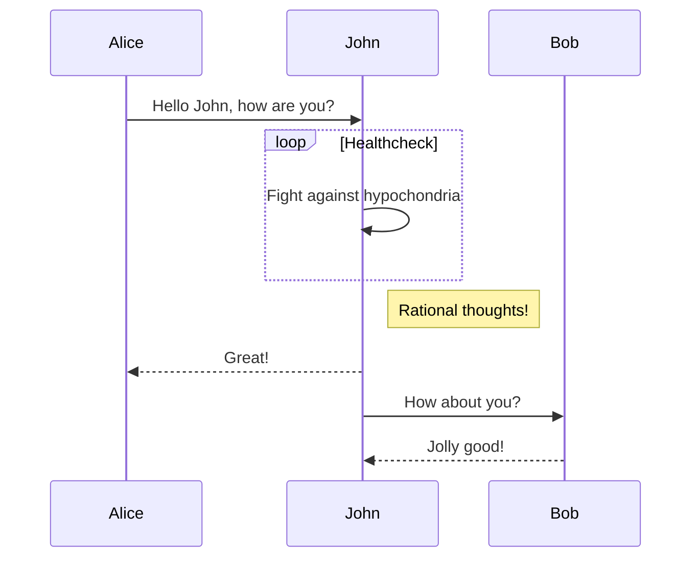

This is a [Next.js](https://nextjs.org/) project bootstrapped with [`create-next-app`](https://github.com/vercel/next.js/tree/canary/packages/create-next-app).

叔母の結婚式の為の寄せ書き＆写真共有アプリを作成しました。
フロントエンドの技術にNextJS+ChakraUIを選定しているのに加え、メッセージ投稿時や写真投稿時の通知メッセージを管理するのに状態管理ライブラリであるJotaiを使用しました。
バックエンドの技術として、メッセージの保存にはHasuraCloudを使用し、写真の保存にはCloudinaryというサービスを使用しました。
# 技術選定(フロントエンド)

## NextJS
create-next-appで簡単にReactの環境を構築出来るため使用しました。

## ChakraUI
UIフレームワークには、Tailwindスタイルの高速なスタイリングが可能なChakraUIを使用しました。

## Jotai
メッセージ投稿時や写真投稿時の通知メッセージを管理するのにJotaiというグローバル状態管理ライブラリを使用しました。

## apolloクライアント
バックエンドにHasuraCloudを

# 

