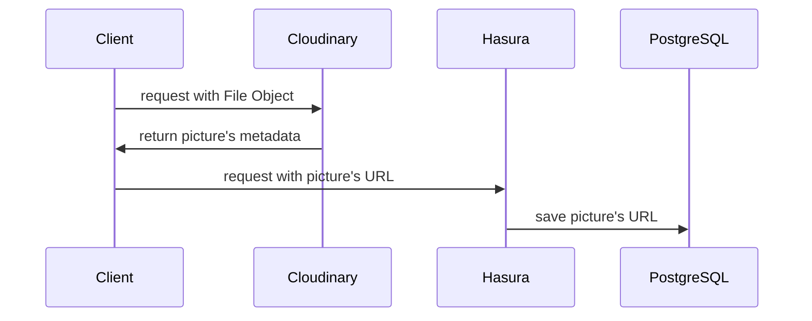

This is a [Next.js](https://nextjs.org/) project bootstrapped with [`create-next-app`](https://github.com/vercel/next.js/tree/canary/packages/create-next-app).

叔母の結婚式の為のメッセージ＆写真共有アプリを作成しました。
https://masaki-satoko.net
# 技術選定(フロントエンド)

## NextJS
create-next-appで簡単にReactの環境を構築出来るため使用しました。

## ChakraUI
UIフレームワークには、Tailwindスタイルの高速なスタイリングが可能なChakraUIを使用しました。

## Jotai
メッセージ投稿時や写真投稿時の通知メッセージを管理するのにJotaiというグローバル状態管理ライブラリを使用しました。

## apolloクライアント
バックエンドにHasuraCloudを使用している為、使用しました。hooksを用いた宣言的データフェッチが可能な点が便利だと感じました。

# 技術選定(バックエンド)

## HasuraCloud
DBのスキーマ定義からGraphQLのAPIを自動生成するHasuraというOSSを使用しました。
バックエンドのコードを書く手間が省けるだけでなく、HasuraCloudを使うとインフラの管理の必要性も無く、
開発の高速化に貢献してくれたと思います。

## Cloudinary
画像の保存にはCloudinaryというサービスを使用しました。Fileオブジェクトを扱うWebAPIの経験が今まで無かったため、
この機能の実装に一番時間がかかったと思います。(参考にした動画→https://www.youtube.com/watch?v=7lhUsK-FxYI)  
以下は画像保存機能のシーケンス図です。

